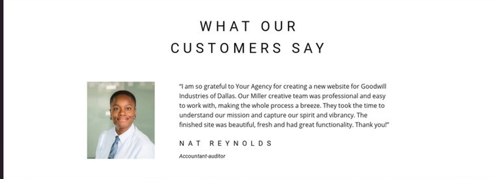
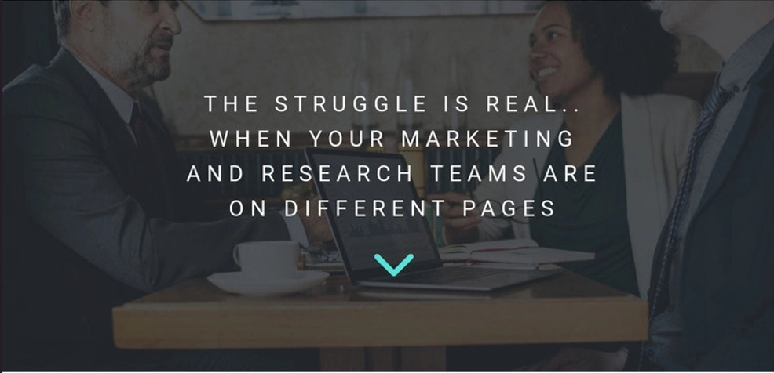

# Reflection on Connection Research and Strategy Website

## Overview
The Connection Research and Strategy website serves as a digital platform for an independent agency specializing in business valuation and sales. This reflection discusses the main concepts applied during the development, the skills acquired, insights gained, and the challenges faced along with the solutions implemented.

## Main Concepts Applied

- **HTML Structure**: The website is structured using HTML5, which provides a clear and organized layout for content.

- **Semantic HTML**: Utilization of semantic elements like `<header>`, `<section>`, and `<footer>` enhances accessibility and improves search engine optimization (SEO).

- **Responsive Design**: The inclusion of the viewport meta tag ensures the website is mobile-friendly, adapting seamlessly to different screen sizes.

- **User  Engagement**: Features such as testimonials, call-to-action buttons, and user registration sections are designed to enhance visitor interaction and retention.

## New Skills or Knowledge Acquired
- **Web Development Fundamentals**: Improved understanding of HTML structure and best practices for organizing web content effectively.

- **CSS Integration**: Gained experience in linking external stylesheets to enhance the visual appeal and layout of the website.

- **Content Structuring**: Learned how to organize content into sections that are easy to navigate, improving overall user experience.

- **User  Experience Design**: Recognized the importance of engaging design elements, such as calls to action and testimonials, in retaining user interest.

## Lessons Learned
- **Clarity in Communication**: Clear and concise information is essential for effective user engagement. Each section of the website serves a specific purpose, facilitating easier navigation for users.

- **Value of Feedback**: Incorporating customer testimonials provides social proof, enhancing the agency's credibility and trustworthiness.

- **Iterative Development**: Building a website is an iterative process. Continuous feedback and analytics should guide future enhancements to improve user experience.

# Challenges Faced and Solutions Implemented

## Challenge
 These are the supposed images needed to be put up in the website and I couldn't get it from the internet.
### Screenshots

*Image 1*

*Image 2*

*Image 3*

*Image 4*

*Image 5*

## Solution
However, I found similar images.
These images below are used in the replicated website using html and css.

### Screenshots

*Image 1*

*Image 2*

*Image 3*

*Image 4*

*Image 5*

*Image 6*

## Conclusion
The development of the Connection Research and Strategy website has been a valuable learning experience, providing insights into web development, user engagement, and content structuring. 